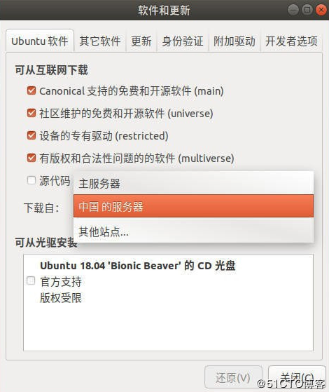

# 换源

找到软件和更新(Ubuntu 16.04 LTS在设置里面),在下载自里选择其他站点...，然后选择mirrors.aliyun.com,点击选择服务器，关闭后， 选择重新载入，等待载入完成。



# 更新

```shell
sudo apt-get update

sudo apt-get upgrade
```

# tree 指令

```shell
sudo apt install tree
```

进入[tree指令官网](http://mama.indstate.edu/users/ice/tree/)，下载.tgz文件后

```shell
sudo apt-get install g++
sudo make install
```

# git

```shell
sudo apt intsall git
```

----------

# 主题美化

## 1.安装unity-tweak-tool：

```shell
sudo apt-get install unity-tweak-tool 
```

## 2.安装flatabulous主题：

`Flatabulous`主题是一款ubuntu下扁平化主题，绝对好看而且安装很方便。

执行以下命令安装`Flatabulous`主题：

```shell
sudo add-apt-repository ppa:noobslab/themes
sudo apt-get update
sudo apt-get install flatabulous-theme
```

该主题有配套的图标，安装方式如下：

```shell
sudo add-apt-repository ppa:noobslab/icons
sudo apt-get update
sudo apt-get install ultra-flat-icons
```

## 3.修改主题和图标

安装完成后，打开unity-tweak-tool软件，修改主题和图标：

进入Theme，修改为Flatabulous。

----------

# 终端美化

## 安装zsh

```shell
sudo apt-get install zsh
```

```shell
zsh --version
/确认是否安装成功
```

```shell
sudo chsh -s $(which zsh)
/设置zsh为默认shell
```

或者：

```shell
chsh -s `which zsh`
```

注销重新登录

```shell
echo $SHELL
/确认zsh是否是默认SHELL，输出/usr/bin/zsh
```

## 安装oh my zsh

```shell
sh -c "$(wget https://raw.githubusercontent.com/robbyrussell/oh-my-zsh/master/tools/install.sh -O -)"
```

## 换个漂亮的主题：

默认配置文件在用户目录下 .zshrc文件中，更改行

```shell
ZSH_THEME="robbyrussell"
```

（换成你的主题），保存。
推荐主题
:    *ys,powerlevel*

通过在~/.zshrc中添加

```shell
export DEFAULT_USER="username"
```

可以隐藏固定的user@hostname信息。

----------

# apt的安装与卸载

## 卸载

`sudo apt remove 软件名`

```shell
sudo apt remove unity-webapps-common
```

## 安装

`sudo apt install 软件名`

```shell
sudo apt remove libappindicator1 libindicator7
```

## 修复安装

```shell
sudo apt -f install
```

----------

# deb 安装

## 谷歌浏览器

```shell
sudo apt remove unity-webapps-common
sudo dpkg -i chrome.deb
sudo apt -f install
```

## 用法

参数|作用
--|--
-i|安装
-c|显示内容
-l|提取信息
-r|移除已安装的包裹

----------

# sudo

## 管理员的文件管理器

```shell
sudo nautilus
```

# power9k

```shell
git clone https://github.com/bhilburn/powerlevel9k.git ~/.oh-my-zsh/custom/themes/powerlevel9k
```

```shell
1. 打开 zsh 配置文件

vi ~/.zshrc

2. 写入配置方案， 主题选择你安装的主题，配色方案可以去上面社区分享的列表去找，比如我的

ZSH_THEME="powerlevel9k/powerlevel9k"
# ZSH_THEME="agnoster"
POWERLEVEL9K_MODE='nerdfont-complete'

POWERLEVEL9K_SHORTEN_DIR_LENGTH=2
POWERLEVEL9K_SHORTEN_STRATEGY="truncate_middle"
POWERLEVEL9K_CONTEXT_DEFAULT_BACKGROUND="000"
POWERLEVEL9K_CONTEXT_DEFAULT_FOREGROUND="007"
POWERLEVEL9K_DIR_HOME_BACKGROUND="001"
POWERLEVEL9K_DIR_HOME_FOREGROUND="000"
POWERLEVEL9K_DIR_HOME_SUBFOLDER_BACKGROUND="001"
POWERLEVEL9K_DIR_HOME_SUBFOLDER_FOREGROUND="000"
POWERLEVEL9K_NODE_VERSION_BACKGROUND="black"
POWERLEVEL9K_NODE_VERSION_FOREGROUND="007"
POWERLEVEL9K_NODE_VERSION_VISUAL_IDENTIFIER_COLOR="002"
POWERLEVEL9K_LOAD_CRITICAL_BACKGROUND="black"
POWERLEVEL9K_LOAD_WARNING_BACKGROUND="black"
POWERLEVEL9K_LOAD_NORMAL_BACKGROUND="black"
POWERLEVEL9K_LOAD_CRITICAL_FOREGROUND="007"
POWERLEVEL9K_LOAD_WARNING_FOREGROUND="007"
POWERLEVEL9K_LOAD_NORMAL_FOREGROUND="007"
POWERLEVEL9K_LOAD_CRITICAL_VISUAL_IDENTIFIER_COLOR="red"
POWERLEVEL9K_LOAD_WARNING_VISUAL_IDENTIFIER_COLOR="yellow"
POWERLEVEL9K_LOAD_NORMAL_VISUAL_IDENTIFIER_COLOR="green"
POWERLEVEL9K_RAM_BACKGROUND="black"
POWERLEVEL9K_RAM_FOREGROUND="007"
POWERLEVEL9K_RAM_VISUAL_IDENTIFIER_COLOR="001"
POWERLEVEL9K_RAM_ELEMENTS=(ram_free)
POWERLEVEL9K_TIME_BACKGROUND="black"
POWERLEVEL9K_TIME_FOREGROUND="007"
POWERLEVEL9K_TIME_FORMAT="%D{%H:%M} %F{003}\uF017"
POWERLEVEL9K_LEFT_PROMPT_ELEMENTS=('context' 'dir' 'vcs')
POWERLEVEL9K_RIGHT_PROMPT_ELEMENTS=('node_version' 'load' 'ram_joined' 'time')
POWERLEVEL9K_LEFT_SEGMENT_SEPARATOR=$'\uE0B0'
POWERLEVEL9K_RIGHT_SEGMENT_SEPARATOR=$'\uE0B2'

3. 使配置文件生效

source ~/.zshrc
```
