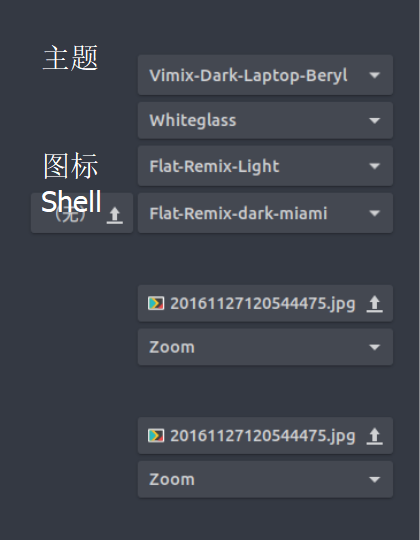
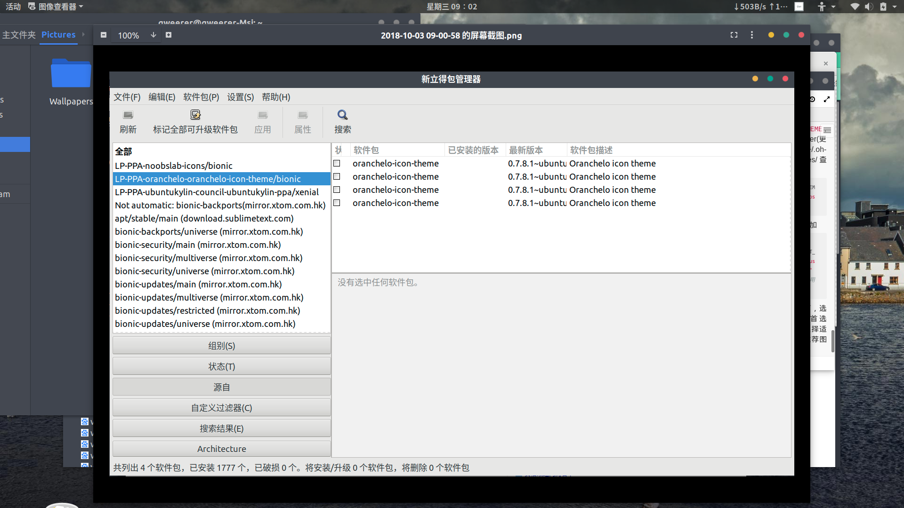
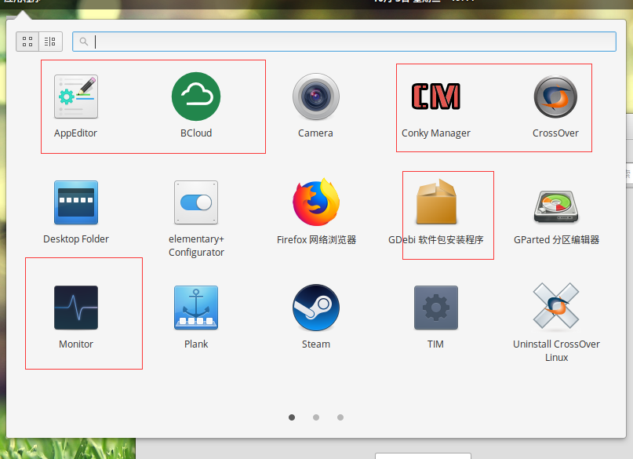

## 管理员的文件管理器
```
sudo nautilus
```

#主题美化


## 安装Gnome-tweak-tool
打开终端执行：
```
sudo apt-get install gnome-tweak-tool
```
## 安装浏览器支持
火狐也需要装
```
sudo apt install chrome-gnome-shell
```

## 浏览器安装插件
火狐[下载](https://addons.mozilla.org/zh-CN/firefox/addon/gnome-shell-integration/?src=search)

安装后进入[本地管理](https://extensions.gnome.org/local/)

### 插件

- [ ] Applications Menu
- [ ] User Themes
- [ ] Dash to Dock
- [ ] Hide top bar
- [ ] Dynamic Panel Transparency

## 主题
[主题网站](https://www.gnome-look.org/)

* 主题安装在

主题与Shell

         /usr/share/themes/ 
图标

         /usr/share/icons/



###　推荐主题

- [1] 主题： Vimix
- [2] 图标： Marwaita Icons
- [3] Shell： Minimal-Conception


----------


## 桌面主题和图标主题推荐
`桌面主题`：https://github.com/vinceliuice/vimix-gtk-themes
`图标主题`：https://github.com/vinceliuice/vimix-icon-theme
`更多图标和主题可以到这里下载`：https://www.opendesktop.org/s/Gnome


## 桌面主题安装：
进入GitHub，下载源文件，解压到目标目录并进入，右键点击空白处选择在终端打开，执行：
``
sudo ./Vimix-installer
``


## 图标主题安装：
### flat icons Oranchelo 
```
You can use the Oranchelo [PPA](https://launchpad.net/~oranchelo/+archive/ubuntu/oranchelo-icon-theme):

    sudo add-apt-repository ppa:oranchelo/oranchelo-icon-theme
    sudo apt-get update
    sudo apt-get install oranchelo-icon-theme
```

### La-capitaine-icon-theme

### 第二种
进入Github，下载源文件，解压到目标目录并进入，右键点击空白处选择在终端打开，执行：
```
sudo ./Installer.sh
```
按提示输入i，y，等待安装完成后，在Gnome-tweak-tool里选择主题。
# 终端美化
## 安装zsh
```
sudo apt-get install zsh
```
## 安装oh-my-zsh

```
sudo wget https://github.com/robbyrussell/oh-my-zsh/raw/master/tools/install.sh -O - | sh
chsh -s /bin/zsh
```

## 安装字体
下载GitHub上的字体到目标目录并解压，进入解压目录，打开终端执行：
```
sudo ./install.sh
```
## 选择主题及一些美化设置
执行：
```
sudo gedit ~/.zshrc
```
找到`ZSH_THEME`,设置为agnoster(更多主题打开~/.oh-my-zsh/themes/查看选择)
```
ZSH_THEME="agnoster"
```
然后在末尾添加
```
export DEFAULT_USER="username" //隐藏用户名
```
右键终端界面，选择配置文件首选项，字体处选择适当的字体，推荐图示字体。

# plank
```
sudo add-apt-repository ppa:ricotz/docky 
sudo apt-get update 
sudo apt-get install plank
sudo ln -s /usr/share/applications/plank.desktop /etc/xdg/autostart/
```
设置键为`CTRL+鼠标右键`
## 主题可以在次下载
```
https://www.deviantart.com/customization/skins/linuxutil/applications/docks/?qh=&section=&q=plank
```
## 主题位置
```
/usr/share/plank/themes/    
```
# 查看软件源
```
sudo apt-get install synaptic
```




## gitkraken

Failed to load module "canberra-gtk-module"的解决方法：  
```
sudo apt-get install libcanberra-gtk-module2.2
```
Error: libgnome-keyring.so.0解决方法:     
```
sudo apt-get install libgnome-keyring-common libgnome-keyring-dev 
```

---------------------
作者：Aodongq1n丶 
来源：CSDN 
原文：https://blog.csdn.net/qq_21148843/article/details/80808877?utm_source=copy 
版权声明：本文为博主原创文章，转载请附上博文链接！
```
