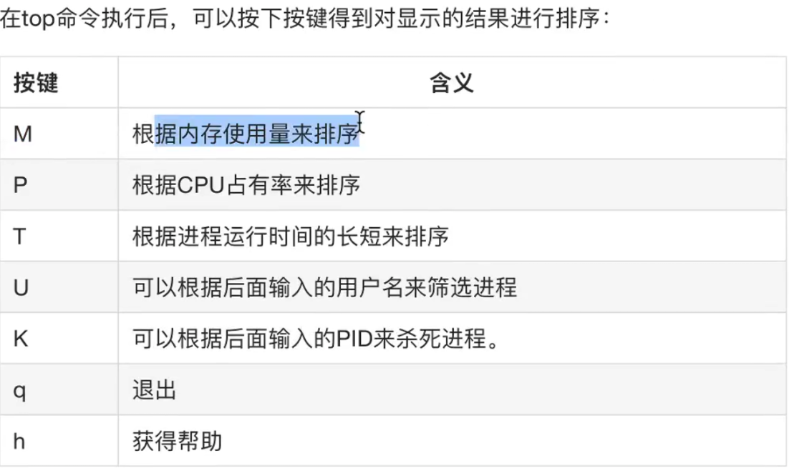
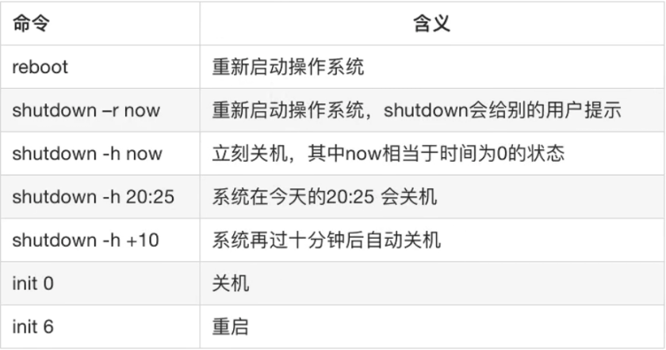
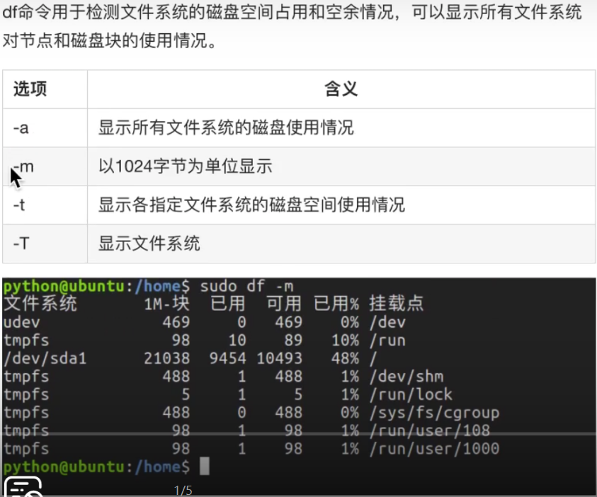
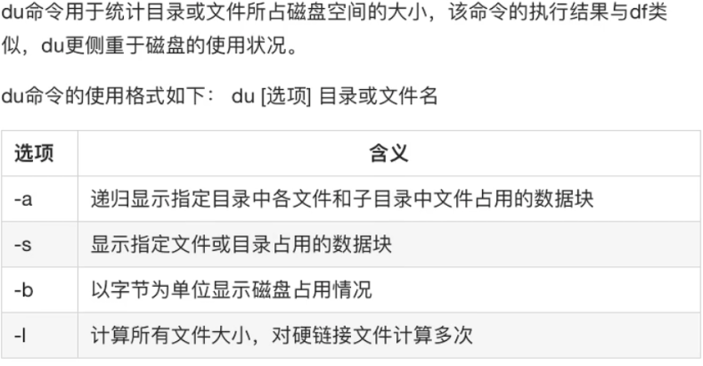
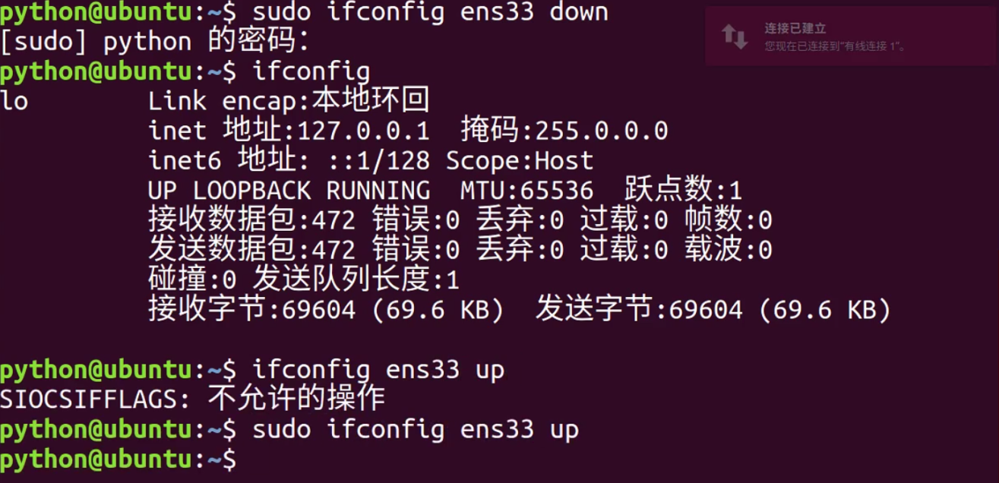

ifconfig
:    网络网卡信息
:    win中用ipconfig
<br>
# 用户

ssh 
:    远程登录

        ssh qweerer@192.168.199.121
        ssh 用户名@地址
<br>

who
:    检查当前登陆用户信息


:    who -q
:    who -u
:    whoami  当前自己登陆的用户名

exit
:    退出登陆

<br>
useradd
:    -m为自动创建Home目录，-m -d 为指定目录

        sudo useradd user11 -m 
        sudo useradd user11 -m -d /home/user02
:    -g 给新建账号分配组

        sudo useradd user22 -m -d /home/user22 -g test
        
passwd
:    修改，设定密码

        sudo passwd user11
        
<br>
su user11
:    切换用户
:    -user 顺便切换home目录

        su - user11
        
<br>
userdel 
:    删除用户

命令|含义
---|---
userdel abc|只删除abc的账号
userdel -r abc|删除abc的账号与家目录

<br>
sudo -s
:    设为root权限

<br>
查看用户
:    1,usermod + 3次tab键
:    2,

<br>
用户组
:   

代码|功能
--|--
groupadd |新建组
groupdel |删除组
cat /ect/group |　 查看组用户
cat /ect/group \| grep xxx |搜索用户组（用户名）   
usermod -g 用户组 用户名 |修改用户主组
usermod -a -G 用户组 用户名 |增加用户的组
groups 用户名|查找用户名所在的用户组

<br>

为普通用户添加sudo权限
:    

        sudo usermod -a -G adm 用户名
        sudo usermod -a -G sudo 用户名
<br>

修改文件权限：chmod
:    

        chmod [u/g/o/a][+/-/=][rwx] 文件名
        chmod u+x 1.txt
        '[u/g/o/a][+/-/=][rwx]'中间无空格


[u/g/o/a]|含义|修改‘谁’对这个文件的权限
--|--|--
u|user| 表示用户
g|group |表示与该文件所有者属于同一组的
o|other| 同组以外的人
a|all|表示以上三者都有

[+/-/=]|含义
--|--
+|增加权限
-|撤销权限
=|设定权限

[rwx]|含义
--|--
r|可读
w|可写
x|可执行

chmod 的数字用法
:    chmod [000][000][000] 文件
:    比如：

        chmod 777 2.py
        '所有人所有权限'
        chmod 444 2.py
        '所有人只读'
        chmod 222 2.py
        '所有人只写'
        chmod 111 2.py
        '所有人只执行'
:    修改目录权限

        chmod 777 111 -R
        '修改111文件件及111文件夹下所有文件'
        
chown 修改文件拥有者
```
sudo chown user 111.py
```
chgrp 修改文件所属的组
```
sudo chgrp group 111.py
```

----------


**date** : 显示时间
**cal** : 显示日历

----------
ps 任务管理器
:    ps：查看当前窗口的运行程序
:    ps -aux ：查看所有运行的程序
    
top 动态显示运行进程
:    

kill pid
:    结束进程
:    kill -9 pid 结束进程

关机、重启
:    

磁盘检测 df
:    

目录占用分析 du
:    

ifconfig
:    1.删除与安装网卡

:    2.更改IP地址


netstat 命令
:   列出所有处于监听状态的tcp端口
        
        netstat -lt
:   查看所有的端口信息, 包括 PID 和进程名称
        
        netstat -lt

过滤得到当前系统中的 ssh 进程信息
:   

        ps -aux | grep 'ssh'
