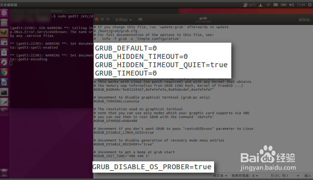

# 安装时黑屏：
处于Grub的安装选项时，选择`试用Ubuntu` 按`e`进入编辑模式，
找到`quiet splash`，在后面增加`nomodeset`，按F10开启系统

# 初次启动系统
在Grub界面选择第一项，按`e`进入编辑模式，
找到`quiet splash`，在后面增加`nomodeset`，按F10开启系统


# 安装完显卡驱动后
安装完成后马上跟新显卡驱动，否则开机必须重复 `初次启动系统`时的步骤

# 开机跳过Grub
## 1
```
sudo gedit /etc/default/grub
```

## 2
```
GRUB_TIMEOUT=1
# set waiting time
GRUB_CMDLINE_LINUX_DEFAULT="quiet splash "
# navida displayer bug
GRUB_DISABLE_OS_PROBER=true
# 关闭对其他系统检测，可以直接进入Linux
```

## 3
```
sudo update-grub
```
# 第三方主题
## 第一步 : 复制GRUB2主题包到/boot/grub/themes


第一个命令， 在/boot/grub里创建GRUB2打主题目录themes
```
        sudo mkdir -p /boot/grub/themes/mytheme
```

复制GRUB2-themes_20151204主题包文件到目录/boot/grub/themes

```
        sudo cp -an ~/桌面/GRUB2-themes_20151204/* /boot/grub/themes
```
## 第二步：修改GRUB配置文件并更新。
```
sudo gedit /etc/default/grub
```
在开头加入
```
GRUB_THEME=/boot/grub/themes/Aurora-Penguinis-GRUB2/theme.txt
```

## ~~第二步：修改GRUB配置文件并更新。~~
~~打开/etc/grub.d/00_header文件~~
```
        sudo gedit /etc/grub.d/00_header
```
~~在开头注释后添加~~
```
        GRUB_THEME="/boot/grub/themes/Aurora-Penguinis-GRUB2/theme.txt"
        GRUB_GFXMODE="1024x768x32"
```


## 第三步：更新GRUB
```
    sudo update-grub
```
