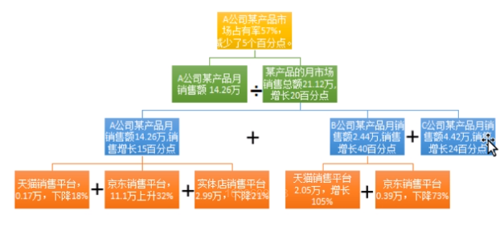
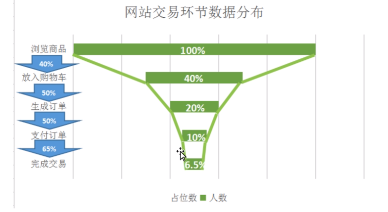

# 简单数据分析

## 比较分析

- 特征:通过比较不同事物的特征,发现差异性变化,从中得出数据差异所代表的含义和规律
- 分类
  - 静态比较:同一时间,相同指标,在不同个体之间的比较,也叫作`横比`
    - 与目标比较  如:实际完成值与目标值的对比
    - 同级别比较  如:不同地区同一单位部门比较
    - 绝对数指标比较,个体的指标与总体的平均值指标比较
  - 动态比较:同一总体,相同指标,在不同时期比较,也叫作`纵比`
    - 不同时期对比
      - 同比:上1年同周期对比
      - 环比:上一个周期对比
    - 活动效果对比:进行活动前后,同一个个体做比较
- 对比分析所需的指标分类
  - 总量指标,也叫作*绝对指标*
  - 相对指标
  - 平均指标
- 注意事项
  - 指标单位必须统一,计算公式必须一致
  - 同级同类型,才有可比性
  - 对比指标通常要保持一致.

## 分组分析

- 涉入到总体内部最重要的分析方法
- 特征:根据数据特征,按照一定指标,把数据划分为不同的群组进行研究,以求揭示个组内在联系的规律
- 目的:把性质相同的个体聚集起来,让每一个组内不同个体的差异最小,各个组之间不同的差异最大
- 原则:
  - 穷尽原则:总体中的每个单位都应有组可归,每一个分组都可以容纳总体中的所有单位
  - 互斥原则:分出指标的限制下,总体中的任何一个单位只能归属于某一组而不能同时属于几个组
- 分组参数
  - 组限:有组上限与组下限,
  - 组距:组上限与组下限的差距
  - 组数:一个总体分为几个组
- 步骤
  - 组数的确定:完全依赖于分析师的经验
  - 确定组距:

## 结构分析法

- 概述:部分与总体进行对比的方法
- 市场占有率
  - 市场占有率=某种商品的销量/该产品的市场销售总量

## 交叉分析法(立体分析法)

- 概述: 结合纵向分析与横向分析.
- 很多时候通过交叉分析表来实现,借助于透视表的功能,很容易得出来.

### 综合评价法

- 概述:多个指标,多个产品单位评价的方法
- 步骤:
  - 1.确定综合评价指标体系(用哪几个指标评价数据)
  - 2.收集数据,必要时需要标准化数据,以求消除量程
  - 3.确定指标值中各个指标的权重
  - 4.加权平均计算总的评价分值
  - 5.凭借分值排名
- 注意事项:
  - 1.要对各个指标同时评定,结合各个不同指标的关系
  - 2.重要指标不要忘记加权
  - 3.对各个指标的数据,要根据实际情况进行数据标准化
- 数据标准化
  - 归一化
    - 概念:将数据全部划分至0~1之间
    - 作用:消除量纲,提升模型的~~施展速度?~~,有利于数据的敏感性,绘图.输出更加均匀

### 杜邦分析法

- 特点:金字塔结构层层分析,各层存在因果关系,更多的时候是严格的函数关系
- 缺点:用法比较单一,主要用于财务上.
- 有点:层次清晰明了,结构简单工整

### 漏斗图分析法

- 用于业务流程比较规范,周期长,环节多的流程分析.通过漏斗图各个环节业务数据的比较,能直观的发现问题所在

