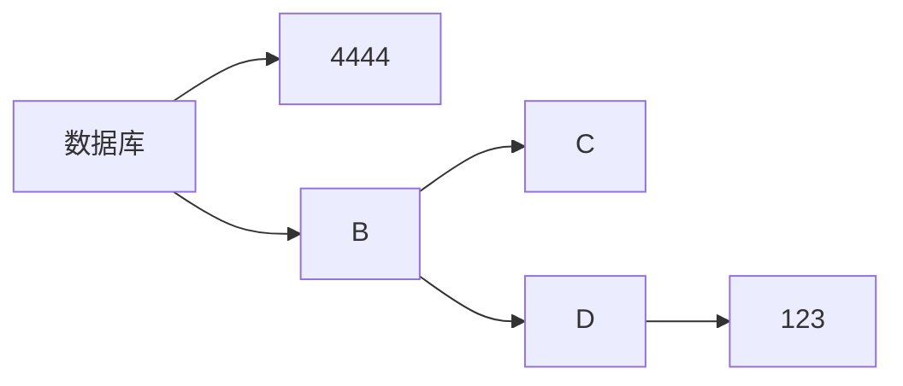

# 操作

## 2.数据库操作

- 1.创建数据库
  - 格式: `create database 数据库名 charset=utf8;`
  - 示例: `create database sunck charset=utf8;`
- 2.删除数据库
  - 格式: `drop database 数据库名;`
  - 示例: `drop database sunk;`
- 3.切换数据库
  - 格式: `use 数据库名;`
  - 示例: `use sunck;`
- 4.查看当前选择的数据库
  - `select database();`

## 3.表操作

- 1.查看当前数据库中所有表
  - `show tables;`
- 2.创建表
  - 格式: `create table 表名(列及类型)`
  - 说明:
    字段           |含义
    --------------|--
    auto_increment|自增长
    primary key   |主键
    nut null      |不为空值
    default 数值   |默认值
  - 示例

        creat table student(
            id      int         auto_increment primary key,
            name    varchar(20) nut null,
            age     int         nut null,
            gender  bit         default 1,
            address varchar(20),
            isDel   bit         default 0
        );

