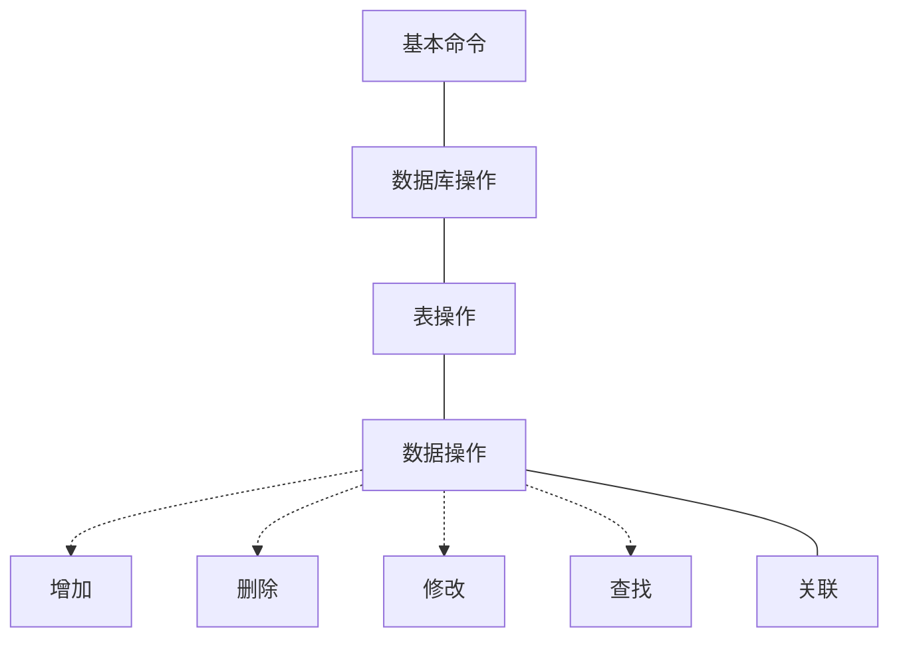

# mySQL基本命令

## 一.基本命令

- 1.启动服务
  - 格式:`net start 服务名称`
  - 示例:`net start mysql157`
- 2.关闭服务
  - 格式:`net stop 服务名称`
  - 示例:`net stop mysql157`
- 3.链接服务
  - 格式:`mysql -u 用户名 -p`
  - 示例:`mysql -u root -p`
- 4.远程链接
  - 格式:`mysql -h ip地址 -u 用户名 -p`
  - 示例:`mysql -h 192.168.1.100 -u root -p`
- 5.断开链接
  - `exit`或者`quit`
- 6.查看版本
  - `select version()`
- 7.显示当前时间
  - `select now()`

## 二.数据库操作

- 1.创建数据库
  - 格式: `create database 数据库名 charset=utf8;`
  - 示例: `create database sunck charset=utf8;`
- 2.删除数据库
  - 格式: `drop database 数据库名;`
  - 示例: `drop database sunk;`
- 3.切换数据库
  - 格式: `use 数据库名;`
  - 示例: `use sunck;`
- 4.查看当前选择的数据库
  - `select database();`

## 三.表操作

- 1.查看当前数据库中所有表
  - `show tables;`
- 2.创建表
  - 格式: `create table 表名(列及类型);`
  - 说明:
    字段           |含义
    --------------|--
    auto_increment|自增长
    primary key   |主键
    nut null      |不为空值
    default 数值   |默认值
  - 示例

        creat table student(
            id      int         auto_increment primary key,
            name    varchar(20) nut null,
            age     int         nut null,
            gender  bit         default 1,
            address varchar(20),
            isDel   bit         default 0
        );
- 3.删除表
  - 格式:`drop table 表名`
  - 示例:`drop table student`

## 四.数据操作

### 1.增加

### 2.删除

### 3.修改

## 五.查找

## 六.关联
