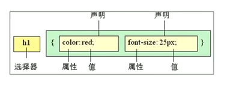

# CSS01

#web/css

> css是层叠样式表(Cascading Style Sheets)的简称




## 在html文件中定义

```html
<!DOCTYPE html>
<html lang="en">
<head>
 <meta charset="UTF-8">
 <meta http-equiv="X-UA-Compatible" content="IE=edge">
 <meta name="viewport" content="width=device-width, initial-scale=1.0">
 <title>表格案例</title>
 <style>
	 p {
	 	color: red;
		font-size: 30px;
	 }
 </style>
</head>
```

## 选择器

### 类选择器

```html
<style>
	.red {
		color: red;
	}
</style>

<p class='red'>将本段落通过class定义为class类</p>
```