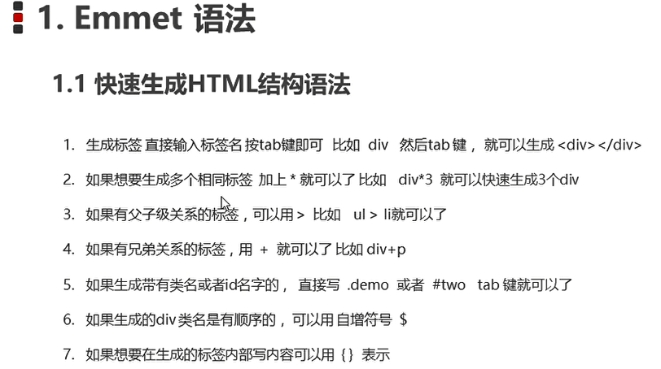

# 2-CSS-02

#web/css 

## Emmet语法



```html
table>form>div.div0$*5{这是5个div1}+p.pro*2{这是$个p}
```

```html
<table>
 <form action="">
 	<div class="div01">这是5个div1</div>
 	<div class="div02">这是5个div1</div>
 	<div class="div03">这是5个div1</div>
 	<div class="div04">这是5个div1</div>
 	<div class="div05">这是5个div1</div>
 	<p class="pro">这是1个p</p>
 	<p class="pro">这是2个p</p>
 </form>
</table>
```

## 复合选择器

- [后代选择器](#后代选择器)
- [子选择器](#子选择器)
- [并集选择器](#并集选择器)
- [伪类选择器](#伪类选择器)

### 后代选择器

```html
<style>
	ol li {
		color: pink
	}
	.test li {
		color: red
	}
</style>

<ol>
	这里不变色
	<li>这里变色</li>
	<div><li>这里变色</li></div>
</ol>
<ul>
	<li>这里不变色</li>
</ul>
<ol class='test'>
	<li>这里红色</li>
</ol>
```

### 子选择器
```html
<style>
	ol>li {
		color: pink
	}
</style>

<ol>
	<li>这里变色</li>
	<div><li>这里不变色</li></div>
</ol>
```
### 并集选择器
```html
<style>
	ol li,
	ol div {
		color: pink
	}
</style>

<ol>
	<li>这里变色</li>
	<div>这里变色</div>
</ol>
```
### 伪类选择器

- 链接伪类 ==4个伪类的先后顺序不能改变,必须是LVHA, 但可与省略==
	- `a:link`: 选择所有未被访问的链接
	- `a:visited`: 选择所有已被访问的链接
	- `a:hober`: 鼠标位于其上的链接
	- `a:active`: 鼠标按下为弹起的链接
```html
<style>
    a {
        color: black;
        text-decoration: none;
    }
    a:visited{
        color: grey;
        text-decoration: none;
    }
    a:hover {
        color: blue;
        text-decoration: underline;
    }
```
- 焦点选择器
	- `input:focus` 选中input表单时的样式

## 转化为块元素
```html
<style>
    a {
		display: block;<!-- inline/inline-block -->
        width: 160px;
		height: 500px;
		color: black;
        text-decoration: none;
		background-color: pink;
    }
	a:hover {
        color: blue;
        text-decoration: underline;
    }
```