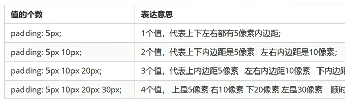

# 2-CSS-03

#web/css 

## border
```css
border: border-width | border-style | border-color
```

- `border-width` 定义边框粗细
- `border-style` 边框样式 `solid, none, hidden, dashed, dotted`等等
- `border-color` 边框颜色

### border-collaps
相邻边框层叠
```css
border-collapse: collapse;
```

## padding内边距



>  #htext/apply 使用padding可以简单实现几个文字与单词平均分布

## margin

顺序与padding一致

### 元素居中 #htext/apply
- 块元素居中

通常做法是设置左右两边的`margin`为`auto`

```css
margin-left:auto; margin-right: auto;
margin: auto;
margin: 0 auto;
```

- 行内块元素居中

给其父元素添加`text-align: center;`, 图片``也可以
