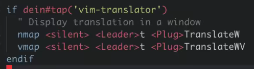

# Linux-命令行翻译

#linux/program 

## fanyi
> [fanyi](https://github.com/afc163/fanyi): 需要nodejs

## vim-translator
> [vim-translator](https://github.com/voldikss/vim-translator): vim插件
>
>使用`:translate`或者`:translateW`显示选中字的翻译

### 快捷键配置
