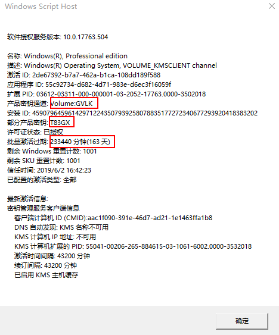
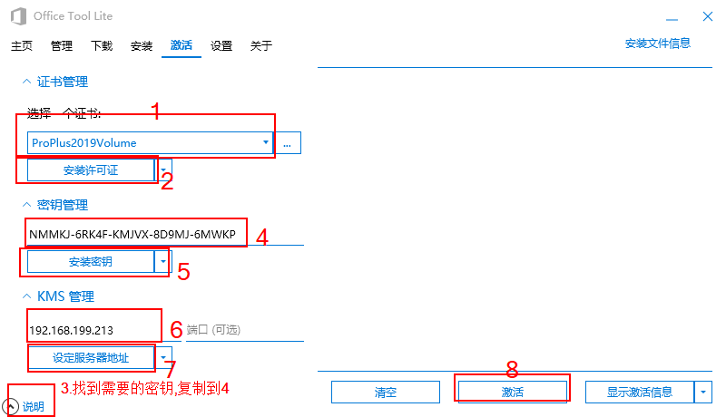

# 激活

## win10 激活

### 查看激活状态

在'运行'程序输入

```win
slmgr.vbs -dlv
```



#### 备用

cmd运行

```cmd
查看系统版本（备用）
wmic os get caption
查看激活详情（备用）
slmgr /dlv
```

### 设置密钥

cmd输入

```c
slmgr /ipk W269N-WFGWX-YVC9B-4J6C9-T83GX
```

### 设置激活命令

cmd输入

```c
slmgr /skms kms.loli.beer && slmgr /ato
```

### 其他kms网站

```web
https://v0v.bid/
```

#### 自建服务器

```c
教程:https://github.com/dylanbai8/kmspro
软件:https://github.com/Wind4/vlmcsd/releases
```

在虚拟机解压后,运行

```c
\binaries\Windows\intel\vlmcsd-Windows-x64.exe
或者：
\binaries\Windows\intel\vlmcsd-Windows-x86.exe
```

## office激活

> 需要注意,office激活的服务器要与win激活的服务器相同

本机的win模拟器服务器ip'192.168.199.213'

